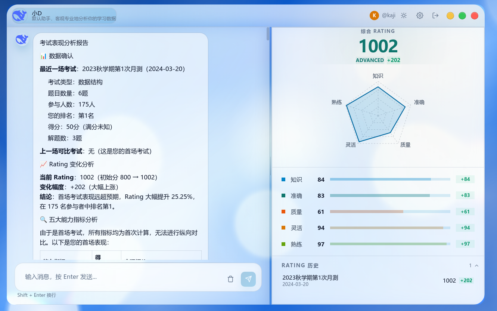
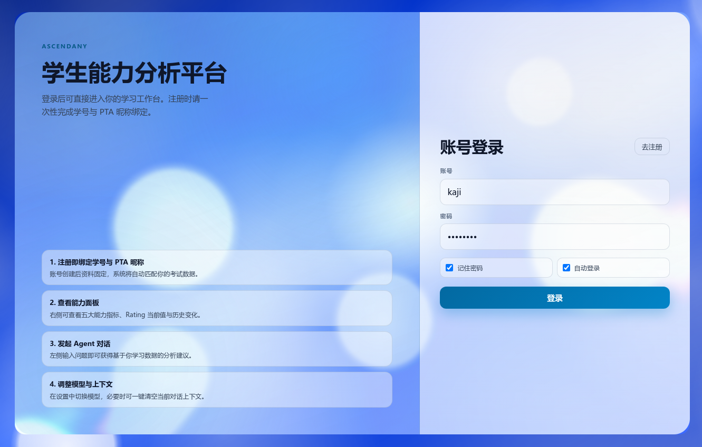
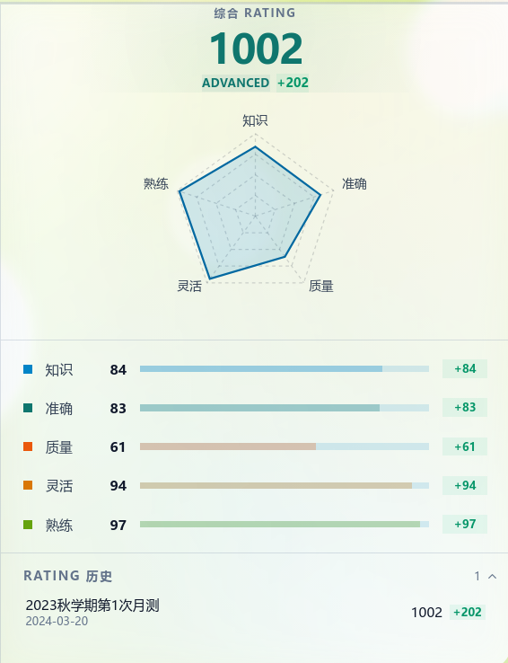
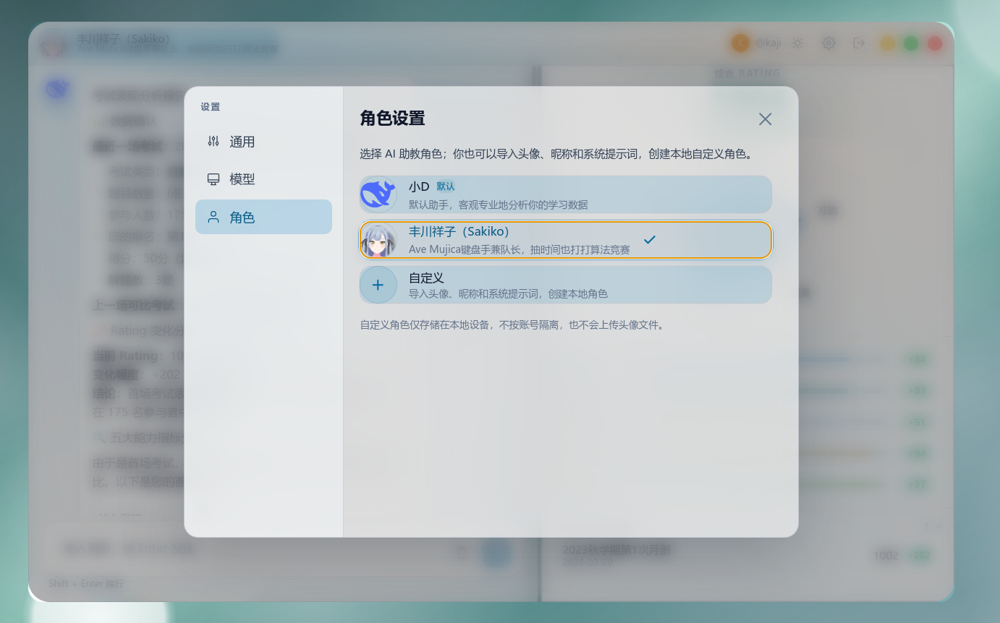

# AscendAny

  

  <strong>学生能力分析平台</strong>

  把程序设计考试数据转化为可解释的成长洞察，帮助学生看清近期表现，也帮助教师快速定位教学关注点。

## 项目简介

AscendAny 面向程序设计课程、训练营和班级考试场景。平台持续接收考试数据，自动形成学生画像，并通过 AI 助手解释近期表现、能力变化和训练重点。

它关注三个核心问题：

- 学生最近一场考试表现如何，排名、得分、解题数和历史变化是否清晰。
- 五个能力维度如何变化，强项和短板能否一眼看出。
- 下一阶段训练应该优先补什么，建议能否直接用于复盘和学习。

## 核心能力

### 增量考试导入

每个考试目录都可以作为一次独立考试导入。平台会识别新增考试和新增快照，保留历史数据，并避免重复导入同一批记录。

### 五维能力画像

平台将考试表现拆解为五个维度：

| 维度 | 含义 |
| --- | --- |
| 知识 | 反映知识点掌握程度，结合通过率和得分表现。 |
| 准确 | 关注 AC 前提交次数，衡量解题稳定性和试错成本。 |
| 质量 | 结合运行时表现等数据，描述解法质量。 |
| 灵活 | 观察切题节奏和卡题时长，反映临场策略调整能力。 |
| 熟练 | 关注解题速度和完成节奏，呈现训练熟练度。 |

### Rating 追踪

每场考试都会更新综合 rating，并记录本场变化。学生可以看到自己的成长趋势，教师也可以据此观察班级整体变化。

### AI 智能解读

AI 助手可以结合考试记录、能力指标和 rating 历史，生成近期表现分析、短板解释、题目推荐和训练建议。学生可以继续追问某次考试、某个指标或下一步学习计划。

## 界面预览

### 登录与账号绑定

注册后绑定学号和平台昵称，系统会将账号与考试数据关联，进入个人学习工作台。

### 学习工作台

左侧保留历史对话和入口，中间展示 AI 分析内容、题目推荐与学习路径提醒，右侧集中呈现能力、历史、地图和笔记等学习面板。

### 能力面板

能力面板展示综合 rating、五维雷达图和各项能力分。学生可以快速判断当前强项、短板和最近一次考试带来的变化。

### AI 角色切换

平台支持切换 AI 助教角色，也支持本地自定义角色，用不同语气和分析风格陪伴复盘。

## 从考试数据到学习建议

1. 放入新的考试数据。
2. 平台扫描新增考试和快照。
3. 数据标准化后进入学生能力计算流程。
4. 系统生成五维能力分、rating 变化和历史趋势。
5. AI 助手基于最新数据给出可执行的学习建议。

## 适合谁使用

- 学生：查看近期考试表现、能力短板和下一步训练重点。
- 教师与助教：观察班级学习状态，定位共性问题和个体差异。
- 管理者：维护考试数据导入流程，跟踪导入进度和数据质量。

## 平台组成

- 学生端：桌面端、Web 访问和 Android 应用。
- 管理端：导入控制台，用于发起数据导入和查看任务进度。
- 后端服务：提供认证、学生画像、考试分析、AI 对话和导入任务接口。
- 数据预处理：负责考试扫描、解析、导入和能力指标计算。

## 项目入口

| 模块 | 说明 |
| --- | --- |
| `apps/desktop/` | 学生桌面端与桌面端 Web 构建入口。 |
| `apps/mobile/` | Android 应用入口。 |
| `apps/import-console/` | 管理员导入控制台。 |
| `apps/api/` | FastAPI 后端服务。 |
| `preprocess/` | 考试数据预处理与增量导入。 |
| `doc/` | 数据规范、能力模型、平台架构和部署文档。 |

更多开发、部署和数据规范说明见 [文档索引](doc/文档索引.md)。
