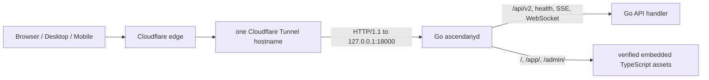

# AscendAny v2 public delivery contract

本文定义 `ascendany.kkkzbh.cn` 的唯一 public delivery path。Cloudflare 只承担 edge 与 Tunnel transport；Go `ascendanyd` 是 km6 的唯一 HTTP origin，并同时交付由 TypeScript 构建的 immutable static assets。

## Ownership 与 topology



Public hostname 只有一条 origin route：

| Public path | Owner | Behavior |
| --- | --- | --- |
| `/api/v2` 与 `/api/v2/*` | Go API | HTTP、SSE、LSP WebSocket 与 internal trainer transport 原样进入 API handler |
| `/livez`、`/readyz`、`/version` | Go API | public health 与 release identity |
| `/` 与 site assets | TypeScript site bytes，由 Go 交付 | product site；无 SPA fallback |
| `/app/` | TypeScript student web bytes，由 Go 交付 | BrowserRouter basename 固定为 `/app`；HTML navigation 才允许 app index fallback |
| `/admin/` | TypeScript import console bytes，由 Go 交付 | BrowserRouter basename 固定为 `/admin`；HTML navigation 才允许 admin index fallback |

`/app` 与 `/admin` 永久重定向到带尾部 `/` 的 canonical route。Static handler 拒绝非 canonical path、encoded path、traversal、重复 slash、未知 asset extension 与 static mutation method。`/app` 和 `/admin` 的 fallback 不处理带 extension 的 missing asset，也不处理缺少 `Accept: text/html` 的请求。API、health、SSE 与 WebSocket 在 static path validation 前进入原 Go handler。

## Same-release build closure

三个 Vite package 使用固定 base contract：

- `@ascendany/site` → `/`
- `@ascendany/web` → `/app/`
- `@ascendany/import-console` → `/admin/`

执行：

```bash
pnpm public-assets:generate
```

生成器清除所有 ambient `VITE_*` 与 `NODE_OPTIONS`，依次执行三个 production build，将 closed output tree 写入 `backend/internal/publicdelivery/assets/`，并生成 `ascendany.public-assets.v1` manifest。Manifest 对每个 regular file 固定 relative path、byte size、SHA-256 与 cache class；entry-set 必须完整、唯一、byte-sorted。`ascendanyd` 使用 `go:embed` 把这些 bytes 编入 server binary，并在启动时重新验证 manifest 与每个 byte digest。Server release manifest 已对最终 `ascendanyd` binary 计算 SHA-256，因此 static bytes 与 Go release identity 处于同一 release closure。

生成器使用 HTML parser 与闭合的 active-resource attribute matrix，拒绝 inline script/style、event attribute、外部或缺失的 HTML resource。Production CSS grammar 禁止 `@import`、escaped token 与 `image-set`，并校验每个 `url()` 指向已收录 asset。生成器还拒绝 symlink、非 regular file、未知 extension、单文件超过 4 MiB、总量超过 16 MiB、文件数超过 256 或 manifest 超过 64 KiB。`--write` 与 `--check` 共用 package-root kernel advisory lock；竞争者直接失败，owner 进程退出时内核自动释放。Static assets 不作为独立 release inventory entry；现有 `ascendanyd` binary digest 完整覆盖这些 bytes。

CI 执行：

```bash
pnpm public-assets:check
```

该 gate 从 TypeScript source 重新构建三个 package，逐 path、逐 byte 对比 committed embedded assets。任一 source/build output/base path 漂移都会失败。

## HTTP security 与 caching

- Hashed Vite assets 使用 `Cache-Control: public, max-age=31536000, immutable` 与 content SHA-256 ETag。
- HTML、favicon 与 release metadata 使用 `Cache-Control: no-cache`。
- Static responses 使用闭合 extension→`Content-Type` mapping，并设置 `nosniff`。
- Static responses 设置 CSP、`frame-ancestors 'none'`、COOP、Permissions Policy、Referrer Policy 与 frame denial。`/app` 与 `/admin` 的 `connect-src` 只允许同源；site 独立获得 `https://api.github.com` 的 release metadata read authority。现有 progress UI 需要 inline style attribute；inline script、eval、worker、object 与 media 均被禁止。
- Site 只从固定 AscendAny GitHub Releases endpoint 读取 release asset metadata；请求失败时页面明确显示 metadata unavailable，并保持下载按钮关闭。仓库内没有第二份 release manifest 或 stale fallback。
- API response headers 保持 Go handler ownership；static wrapper 不会改写 CORS、SSE、WebSocket protocol 或 API cache policy。

## Cloudflare edge contract

Cloudflare configuration 不进入 application source，也不接收 application secret。Production acceptance 必须证明：

1. `ascendany.kkkzbh.cn` 是唯一 public application hostname，origin 是 `http://127.0.0.1:18000`。独立的 `ascendany-trainer.kkkzbh.cn` 仅承载 path-closed internal trainer transport，不提供产品页面或普通 API。
2. Hostname 没有 overlapping Worker route。WebSocket 在 zone 上启用。该项由 cutover operator 的 Cloudflare zone read evidence 与 public WebSocket probe验收，不由 connector-local gate推断。
3. Tunnel 保留 HTTP/1.1 chunked transfer。Go SSE response 已设置 `Content-Type: text/event-stream; charset=utf-8`，Cloudflare Tunnel 据此实时转发。
4. `cloudflared` connector 固定为 Fedora host 上的 Cloudflare 官方 `2026.7.1-1.x86_64` signed RPM。Release lock 绑定 RPM SHA-256、signing fingerprint、header/payload/file manifest 与 `/usr/bin/cloudflared` bytes；release-owned native systemd unit 使用 `DynamicUser`、empty capabilities、seccomp、`no-new-privileges`、closed address families 和 encrypted tunnel-scoped JSON credential。Locally managed ingress 固定 public/shadow v2、trainer `/version`、scoped claims、trainer 404 与 global 404 顺序。Staged/smoke 通过 legacy DB-backed route 证明 public DNS 尚未切换；production 通过 public/shadow/trainer 的 exact version bytes 证明全部到达 loopback v2，并拒绝旧 Podman connector、token directory 与 account-wide API credential。
5. `ascendanyd` 只信任 loopback proxy CIDR，并只从 `CF-Connecting-IP` 读取 client IP。当前 production config contract固定 `127.0.0.1/32` 与该 header。
6. Cutover operator 的独立 public E2E evidence覆盖 `/`、`/app/`、`/app/<deep-route>`、`/admin/`、`/admin/<deep-route>`、`/livez`、`/readyz`、`/version`、一个 authorized API read、一个 SSE reconnect 和一个 LSP WebSocket attach。Release-owned connector gate只承担无认证的 public/trainer `/version` route binding与trainer 404；缺少其余E2E evidence时 production acceptance仍未完成。

Cloudflare 官方依据：

- [cloudflared 2026.7.1 release](https://github.com/cloudflare/cloudflared/releases/tag/2026.7.1)
- [Remotely managed Tunnel configuration API](https://developers.cloudflare.com/api/resources/zero_trust/subresources/tunnels/subresources/cloudflared/subresources/configurations/methods/get/)
- [Pinned cloudflared Tunnel token parser](https://github.com/cloudflare/cloudflared/blob/2026.7.1/cmd/cloudflared/tunnel/subcommands.go#L799-L809)
- [Tunnel ingress、path matching 与 validation](https://developers.cloudflare.com/tunnel/advanced/local-management/configuration-file/)
- [Tunnel streaming、WebSocket 与 overlapping Worker route diagnostics](https://developers.cloudflare.com/cloudflare-one/networks/connectors/cloudflare-tunnel/troubleshoot-tunnels/common-errors/)
- [Tunnel origin HTTP parameters](https://developers.cloudflare.com/cloudflare-one/networks/connectors/cloudflare-tunnel/configure-tunnels/origin-parameters/)
- [Tunnel source IP 与 `CF-Connecting-IP`](https://developers.cloudflare.com/cloudflare-one/networks/connectivity-options/)

## Cutover 与 rollback

Private acceptance 期间 public application hostname 的 remotely managed service继续指向旧 `127.0.0.1:8000`，v2 在 `127.0.0.1:18000` 完成 static/API/SSE/WebSocket smoke；`staged` 与 `smoke` machine gate 都通过 Cloudflare configuration API要求该 remote service保持旧端口。Dedicated trainer hostname在 staged前用两个精确 path rule连接 v2，并以同 hostname `http_status:404` 收口。Public cutover只把 remote ingress第一条 application service从 `8000` 改为 `18000`，本地 hardened connector进程和命令保持不变；随后 `production` gate校验新 configuration version、route identity与live `/version` bytes。不创建 Pages project、Worker route或新 reverse proxy。

Public switch 后立即运行完整 operator E2E probe并保存Cloudflare zone read evidence。发生 delivery failure 时，在 v2 write-activation commit point 允许的 recovery policy 内将相同 remote ingress service回切到 `8000`；Cloudflare hostname、certificate、cookie origin 与 first-party client API base 均保持不变。长期 rollback policy 仍受 `deploy/v2/README.md` 的 durable v2 write commit point 约束。
