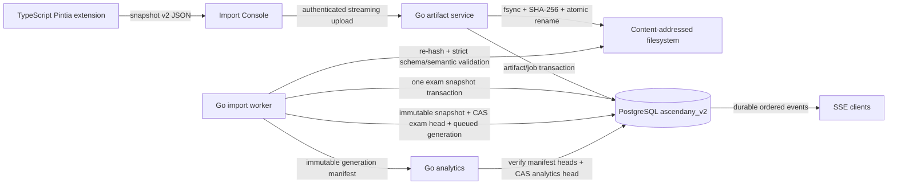

# AscendAny v2 重写架构与验收

本文档定义 AscendAny v2 的唯一实现路径与最终验收边界。v2 从空数据库启动，不迁移旧数据，也不接受旧导入格式。

## 1. Runtime ownership

| 范围 | 唯一 owner | 运行位置 |
| --- | --- | --- |
| Public HTTP、SSE、WebSocket、认证、业务规则、事务、durable jobs | Go `ascendanyd` | km6 |
| 数据库 schema migration | Go `ascendany-migrate` | km6 |
| 数据库与 artifact backup | Go `ascendany-backup` | km6 |
| OJ execution | Go `ascendany-judge`，无网络、无数据库凭据 | km6 isolated systemd instance |
| LSP session | Go `ascendany-lsp`，无网络、无数据库凭据 | km6 isolated systemd instance |
| Desktop、Web、Mobile、Import Console、Site | TypeScript | 用户设备或 static hosting |
| Pintia browser exporter | TypeScript Manifest V3 extension | Chrome |
| Model training orchestration | Go `trainer-agent` | RTX workstation |
| Model training implementation | isolated Python trainer | RTX workstation child process |

Python trainer只读取 Go 生成的 immutable training bundle，并写入 model parameters 与 training diagnostics。Go 重新载入 immutable input，校验参数和 provenance，复算 held-out metrics 与 publication quality gate，并生成 student results。Python child 不持有数据库连接、模型 API key、生产文件系统路径或网络能力。Production 使用独立的 root-owned portable CPython `3.14.6` runtime `/opt/ascendany-trainer-runtime/torch-2.13.0-cu130`，由 exact upstream URL/SHA、complete Python tree identity、30-item distribution closure 与 `/usr`-free bubblewrap CUDA probe host-capability identity 共同封闭 provenance；固定 `torch==2.13.0+cu130`、CUDA `13.0` 和单卡可用性；input/output bundle hard limit 均为 128 MiB。

## 2. Fresh data boundary

- v2 使用独立 PostgreSQL database `ascendany_v2`。
- 旧数据库在切换前生成一次只读离线备份，后续不参与 v2 migration、delta 或 recompute。
- v2 首位管理员通过一次性 bootstrap command 创建；学生账号只能消费管理员为已导入 actor 发放的短期、单次 enrollment claim；旧账号、session、refresh token、SSO row 和配置不复制。
- 唯一可导入考试格式为 `ascendany.pintia.snapshot.v2`。
- 旧 `ascendany.pintia.unit.v1` 文件需要使用新版 TypeScript extension 重新抓取并导出。
- Artifact root 固定为 `/var/lib/ascendany/artifacts`，独立于 release directory。
- `sha256` published namespace 使用 `0750/0640` 并允许独立 backup identity 只读；`incoming` 与 `.locks` 保持 `0700`，backup 无法遍历。

## 3. Pintia import control flow

Artifact publish protocol：

1. Upload stream 写入 `incoming` 临时文件，同时执行 byte limit 和 SHA-256。
2. 临时文件执行 `fsync`。
3. Uploader 持有 `.locks/<sha256>` exclusive `flock`，将文件 atomic rename 到 `sha256/<prefix>/<sha256>`，随后 fsync parent directories。
4. Artifact、job 和首条 event 在一个数据库 transaction 中创建。
5. Worker 再次校验 size 与 SHA-256，然后执行 strict v2 validation。
6. Orphan reconciler 取得相同 per-hash lock 后重新检查数据库引用与最小 age，随后才允许删除 orphan。

Idempotency：同一 bytes 对应同一 artifact 与 import job；同一 typed domain content 对应同一 snapshot；同一 `problemSetId` 的新内容形成新 immutable snapshot。Submission identity invariants 发生变化时返回 permanent `snapshot_conflict`。

## 4. Snapshot and analytics ownership

- Logical exam key 为 `(platform, problemSetId)`。
- Snapshot 保存完整 input manifest、schema digest、artifact digest、domain hash、entity counts 与 source timestamps。
- Domain hash protocol 固定为 `domain_hash_proto_v1`，使用 typed deterministic encoding。
- Analytics generation 保存完整 input manifest、base analytics generation 和 target snapshot。
- Import transaction 先 CAS target exam active snapshot，并原子创建绑定当时全部 exam heads 的 analytics generation。
- Analytics publish transaction重新验证 manifest 中的 exam heads，再 CAS base analytics head；任一 CAS 失败的 generation 标记 `superseded`，随后从最新 heads 重建。
- Recommendation head 按 analytics sequence 单调推进。过期 training result 保留为 `superseded`，不进入 active head。

## 5. Public product behavior

最终 first-party 应用必须覆盖以下行为：

| Domain | Required behavior |
| --- | --- |
| Auth | bootstrap admin、admin-issued enrollment claim、claim/login/refresh/logout、profile、session revocation、role authorization |
| Student | dashboard、ability metrics、rating history、achievements、leaderboard |
| Chat/Agent | non-stream reply、SSE stream、tool execution、auto analysis、notes mutation audit |
| Import | v2 upload、idempotent job、ordered SSE resume、history、failure diagnostics |
| Exam analysis | exam list/detail、generation job、ordered SSE resume |
| Recommendation | active model provenance、fresh/stale/unavailable state、learning path、knowledge detail |
| Admin | accounts、students、audit log、prompt/config versioning、model connection test without secret disclosure |
| OJ | problem bank、run、submit、admin CRUD；全部 code execution 进入 isolated worker |
| LSP | authenticated session、bounded workspace、isolated worker、disconnect cleanup |
| Feedback | authenticated or policy-approved submission、rate limit、delivery audit |

Endpoint shape允许重新设计。所有 TypeScript clients 由最终 OpenAPI document 生成，first-party app 中不保留手写 endpoint string 与重复 response type。

## 6. Security boundary

- `ascendanyd` 以 dedicated OS user 运行；PostgreSQL runtime role 只有 schema usage 与业务 DML 权限。
- Migrator、runtime、backup 使用独立 login 与 capability role。
- Secret 通过 systemd encrypted credential file 提供；process environment 只包含 credential path。
- Database URL 不包含 password。
- Judge、LSP、Python trainer 不接收 production credential。
- OJ container 或 worker unavailable 时直接返回 system error。
- Upload、JSON nesting、collection sizes、code size、SSE replay、chat context、OJ output 与 worker resources 都有 hard limits。
- Unknown fields、dangling references、duplicate identities、count mismatch、hash mismatch 和 partial pagination 会拒绝整个 snapshot。
- 学号与 Pintia public identifier 只用于定位 actor，不构成账号 ownership proof；claim secret 只展示一次、只存 digest、消费后不可复用。

## 7. Cleanup scope

完成 v2 public cutover 与 retention gate 后删除：

- `apps/api/` FastAPI runtime；
- `preprocess/` 及所有 legacy CSV/XLSX/HTML/Pintia v1 parser；
- 旧 `db/schema/`；
- 手写 TypeScript API clients 与重复 DTO；
- root-run Python systemd unit、host OJ execution、release 内 `.env.local`；
- Pintia extension 的手写 JavaScript runtime 与 v1 contract；
- old release、old service 和 retired credentials。

仓库最终保留的 Python 只能位于 isolated model trainer，并由 policy test 检查 import boundary 和 network/credential absence。

## 8. Verification gates

1. `go test ./...`、`go vet ./...`、race tests 和 migration drift tests 通过。
2. Pintia JSON Schema、semantic negative fixtures、domain-hash permutation fixtures 和真实形状脱敏 fixture 全部通过。
3. TypeScript strict typecheck、unit tests、all-app builds、Electron E2E、Web/Mobile/Import Console E2E 通过。
4. PostgreSQL 17 + PgBouncer transaction mode integration tests通过，runtime role 的 DDL/owner access 被拒绝。
5. Artifact crash matrix覆盖 write、fsync、rename、DB commit 与 orphan reconciliation 的每个边界。
6. Import replay、SSE reconnect、worker restart、analytics CAS race、stale trainer result 和 backup restore 测试通过。
7. OJ/LSP attack corpus证明 network、credential、filesystem、PID、CPU、memory 与 output 边界有效。
8. 独立空环境完成 install → migrate → bootstrap admin → Pintia v2 import → issue/consume enrollment claim → analytics → first-party smoke → backup → restore。
9. v2 release固定监听 `127.0.0.1:18000` 且 production config启用写入；release-owned smoke drop-in在 staged/smoke phase将写入关闭。移除该 drop-in、reload 并启用服务构成 write-activation commit point。独立 trainer hostname `ascendany-trainer.kkkzbh.cn` 在 staged前只把 `/version` 与 scoped trainer claims API 路由到 v2，其余路径固定返回 404；public application remote ingress仍指向旧 `8000` 时完成 private write、plugin import、trainer receipt、backup/restore。最后把 remotely managed application service切到 `18000`，再运行要求remote config与public live bytes一致的 production phase gate和独立public E2E验收。
10. Cleanup 后仓库 policy scan证明在线 runtime 无 Python、无 Pintia v1、无 legacy parser、无 host execution 和明文 secret。
