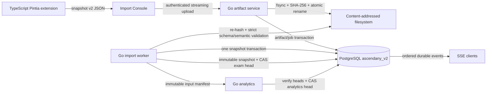

# AscendAny v2 重写架构与验收

本文档定义 AscendAny v2 的唯一实现路径与最终验收边界。v2 从空数据库启动，不迁移旧数据，也不接受旧导入格式。

## 1. Runtime ownership

| 范围 | 唯一 owner | 运行位置 |
| --- | --- | --- |
| Public HTTP、SSE、WebSocket、认证、业务规则、事务、durable jobs | Go `ascendanyd` | km6 |
| 数据库 schema migration | Go `ascendany-migrate` | km6 |
| 数据库与 artifact backup/restore verification | Go `ascendany-backup` | km6 |
| Recommendation artifact verification | Go `ascendany-model` | release build、km6 startup validation |
| Recommendation online inference | Go `ascendanyd` | km6 |
| Catalog publication intent preparation | TypeScript initialization operator | km6 reviewed operator input |
| Catalog publication authorization and canonical request | Go `ascendanyd` | km6 online transaction |
| Catalog publication | Go `ascendany-catalog-publish` | km6 stopped-runtime transaction |
| OJ execution | Go `ascendany-judge`，无网络、无数据库凭据 | km6 isolated systemd instance |
| LSP session | Go `ascendany-lsp`，无网络、无数据库凭据 | km6 isolated systemd instance |
| Desktop、Web、Mobile、Import Console、Site | TypeScript strict mode | 用户设备或 Go embedded static delivery |
| Pintia browser exporter | TypeScript Manifest V3 extension | 用户当前登录的 Chrome |

Model training 属于后续独立模块。Production repository、release、km6、systemd、HTTP API、database roles 与 credentials 均不包含 training process、Python runtime、CUDA/RTX capability 或 trainer transport。

外部模块交付一个已经训练完成的 canonical `ascendany.recommendation.inference-model.v1` artifact 及独立记录的 SHA-256。Artifact、release manifest、runtime config 与 schema-v7 model/catalog provenance 都携带相同的 deployment `purpose`。生产构建、安装、启动和最终 validator 固定要求 `production`；full-E2E 使用显式 `acceptance_test` capability，且 acceptance fixture 不能进入 production path。Release builder 与启动路径使用 Go 验证 closed schema、fixed algorithm、feature schema、knowledge catalog digest、parameter digest、golden-vector digest、numeric envelope 和全部 golden results。`ascendanyd` 将 artifact identity、release version、Git commit 与 build time 绑定到 immutable schema-v7 model release/head 与 catalog publication graph，并在请求读取事务中执行 deterministic Go inference。

## 2. Fresh data boundary

- v2 使用独立 PostgreSQL database `ascendany_v2`；schema-v7 fresh inventory 固定为 54 张 base tables。
- 旧数据库只允许保留 root-only offline evidence，后续不参与 v2 migration、delta、recompute 或 online read。
- v2 首位管理员由一次性 bootstrap command 创建；学生账号通过管理员为已导入 actor 发放的短期、单次 enrollment claim 建立。旧账号、session、refresh token、SSO row 和配置不复制。
- 唯一考试输入为 `ascendany.pintia.snapshot.v2`；旧 Pintia unit 文件必须重新采集。
- 唯一推荐模型输入为 `ascendany.recommendation.inference-model.v1`；生产只接受 release-owned immutable bytes。
- Artifact root 固定为 `/var/lib/ascendany/artifacts`，独立于 release directory。
- Snapshot、analytics generation、model release/head、knowledge catalog version、配置版本和事件均保存 immutable provenance。

## 3. Pintia import control flow

Artifact publish protocol：

1. Upload stream 写入 `incoming` 临时文件，同时执行 byte limit 和 SHA-256。
2. 临时文件执行 `fsync`。
3. Uploader 持有 `.locks/<sha256>` exclusive `flock`，将文件 atomic rename 到 `sha256/<prefix>/<sha256>`，随后 fsync parent directories。
4. Artifact、job 和首条 event 在一个数据库 transaction 中创建。
5. Worker 再次校验 size 与 SHA-256，然后执行 strict v2 validation。
6. Orphan reconciler 取得相同 per-hash lock，重新检查数据库引用与最小 age 后删除 orphan。

Idempotency：同一 bytes 对应同一 artifact 与 import job；同一 typed domain content 对应同一 snapshot；同一 `problemSetId` 的新内容形成新 immutable snapshot。Submission identity invariants 发生变化时返回 permanent `snapshot_conflict`。

## 4. Snapshot、analytics 与 recommendation ownership

- Logical exam key 为 `(platform, problemSetId)`。
- Snapshot 保存完整 input manifest、schema digest、artifact digest、domain hash、entity counts 与 source timestamps。
- Domain hash protocol 固定为 `domain_hash_proto_v1`，使用 typed deterministic encoding。
- Analytics generation 保存完整 input manifest、base analytics generation 和 target snapshot。
- Import transaction 先 CAS target exam active snapshot，并原子创建绑定当时全部 exam heads 的 analytics generation。
- Analytics publish transaction 重新验证 manifest 中的 exam heads，再 CAS base analytics head；CAS 失败的 generation 标记 `superseded`，随后从最新 heads 重建。
- Model artifact、model release、activation event 与 current head 为 immutable/CAS ownership；安装后的 artifact bytes 不允许原地替换。
- Target model register 只创建 immutable release，不修改 current head。空数据库 bootstrap bind 创建无 publication 的 head revision `H1`；该例外只允许发生一次。
- 真实 snapshot import 与 analytics publish 完成后，TypeScript initialization operator 形成 catalog publication intent 并调用 online Go runtime。`ascendanyd` 在一个事务中验证完整 catalog document 与 configuration、analytics、current model、target release preconditions，持久化一个与 canonical request 绑定的短时、单次 authorization。Authorization 与创建它的 administrator access token 同时过期，server-returned request 含 `authorizationId`。
- Access JWT 固定使用 Ed25519/EdDSA。Online runtime 独占 canonical PKCS#8 private signing key；stopped-runtime catalog publisher 只接收匹配的 canonical PKIX public verification key、独立 database credential、server-returned canonical publication request 与对应的 administrator access token。Publisher 只能通过唯一 `SECURITY DEFINER` function `ascendany.publish_authorized_knowledge_catalog(uuid, text, text)` 消费 authorization，没有直接 catalog DML、private key、password、refresh token 或 token issuance capability。成功事务形成一个 immutable publication `P` 和严格的 26-field `ascendany.knowledge_catalog.publication-receipt.v1`，receipt 含 `authorizationId`；相同 authorization/request 的提交后重试只返回同一个 canonical receipt。
- Publication 事务必须把 `P` 原子预留为 current head 唯一的 pending publication；pending 状态会阻止 runtime startup 与 recommendation read。Final bind 必须消费精确匹配的 `P`、清除 pending 状态并创建 head revision `H2` 与唯一 activation event。`H2` 同时绑定 target model release、catalog publication 与 release application identity；缺少任一关联时启动和 recommendation read 直接失败。
- Catalog publication authorization、request、receipt、publication、activation event 与 backup manifest 保持一一对应的 immutable provenance。Backup/restore verification 校验数据库全集、receipt exact entry-set、mode、size 与 SHA-256。
- Recommendation read 使用 `REPEATABLE READ READ ONLY` transaction，同时验证 analytics head、student analytics、model binding、active knowledge catalog digest 和 knowledge identity order。
- Model 与 active catalog 未共同就绪时返回 closed `unavailable` reason；共同就绪时实时计算一个 `fresh` result，并返回 evidence、result SHA-256 与完整 model provenance。

## 5. Public product behavior

| Domain | Required behavior |
| --- | --- |
| Auth | bootstrap admin、admin-issued enrollment claim、claim/login/refresh/logout、profile、session revocation、role authorization |
| Student | dashboard、ability metrics、rating history、achievements、leaderboard |
| Chat/Agent | non-stream reply、SSE stream、tool execution、auto analysis、notes mutation audit |
| Import | snapshot v2 upload、idempotent job、ordered SSE resume、history、failure diagnostics |
| Exam analysis | exam list/detail、generation job、ordered SSE resume |
| Recommendation | `fresh|unavailable`、active model provenance、evidence、learning path、knowledge detail |
| Admin | accounts、students、audit log、prompt/config versioning、knowledge catalog authoring、model connection test without secret disclosure |
| OJ | problem bank、run、submit、admin CRUD；全部 code execution 进入 isolated worker |
| LSP | authenticated session、bounded workspace、isolated worker、disconnect cleanup |
| Feedback | authenticated or policy-approved submission、rate limit、delivery audit |

Endpoint shape 允许升级。所有 TypeScript clients 由 `contracts/openapi/ascendany-v2.yaml` 生成，first-party app 不得保留手写 endpoint string 或重复 DTO。

## 6. Security boundary

- `ascendanyd`、catalog publisher、migrator、backup、restore、judge 与 LSP 使用独立 OS/database capability identity。
- Secret 通过 systemd encrypted credential file 提供；process environment 只包含 credential path。Database URL 不包含 password。
- Judge 与 LSP 不接收 production credential；worker unavailable 时直接返回 system error。
- Model parser 拒绝 non-canonical JSON、unknown fields、digest drift、identity/order/shape drift、non-finite number、超限参数和 golden mismatch。
- Upload、JSON nesting、collection sizes、code size、SSE replay、chat context、OJ output 与 worker resources 都有 hard limits。
- Unknown fields、dangling references、duplicate identities、count/hash mismatch 和 partial pagination 拒绝整个 snapshot。
- 学号与 Pintia public identifier 只用于定位 actor；claim secret 只展示一次、只存 digest、消费后不可复用。

## 7. Cleanup scope

最终仓库与 release 必须删除：

- FastAPI/Python online runtime 与旧数据库 migration path；
- legacy CSV/XLSX/HTML/Pintia v1 parser；
- trainer agent、training queue/run/event API、training database tables/roles、Python trainer、CUDA/RTX runtime 与 trainer credentials；
- 手写 TypeScript API clients 与重复 DTO；
- root-run application unit、host OJ execution、release 内 `.env.local`；
- Pintia extension 的手写 JavaScript runtime 与 page-visible bridge；
- old release、old service、old connector route 与 retired credentials。

Repository policy scan 必须证明 production tree 和 release closure 中没有 Python source/interpreter、trainer execution path、legacy parser、host code execution 或 plaintext secret。

## 8. Verification gates

1. `go test ./...`、`go vet ./...`、race tests、migration drift tests 与 PostgreSQL 17 integration tests 通过。
2. External model JSON Schema、semantic negative fixtures、canonical/digest vectors、production feature order 与 Go golden execution全部通过。
3. Pintia JSON Schema、semantic negative fixtures、domain-hash permutation fixtures 和真实形状脱敏 fixture 全部通过。
4. TypeScript strict typecheck、unit tests、production builds 与 first-party E2E 通过。
5. PostgreSQL 17 + PgBouncer transaction mode integration tests通过，runtime role 的 DDL/owner access 被拒绝。
6. Artifact crash matrix覆盖 write、fsync、rename、DB commit 与 orphan reconciliation 的每个边界。
7. Import replay、SSE reconnect、worker restart、analytics CAS race、model/catalog drift 和 backup restore 测试通过。
8. OJ/LSP attack corpus证明 network、credential、filesystem、PID、CPU、memory 与 output 边界有效。
9. 独立空环境完成 install → migrate → bootstrap admin → register model → bootstrap bind `H1` → Pintia v2 import → analytics → create publication authorization/request → stopped-runtime catalog publish `P` → final bind `H2` → Go recommendation inference → first-party smoke → backup → restore verification。
10. Production release 固定监听 `127.0.0.1:18000`；read-only smoke drop-in关闭 mutation。移除 drop-in、daemon-reload 并启用 service 构成 write-activation commit point。
11. Cloudflare locally managed ingress 仅包含 public、shadow 与 global 404。Public/shadow `/version` bytes 必须与 loopback v2 一致；retired trainer hostname必须删除。
12. Production gate验证 release manifest、model SHA-256、authorization → request → publication → activation binding、fresh Pintia import、current backup/restore evidence 和下一次 backup timer。

唯一可执行的生产顺序位于 `deploy/v2/README.md`。
